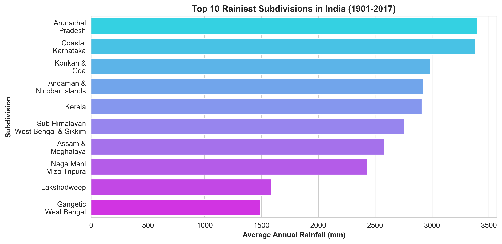
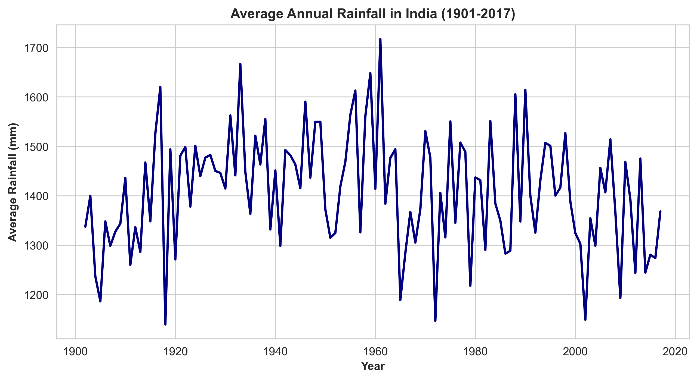
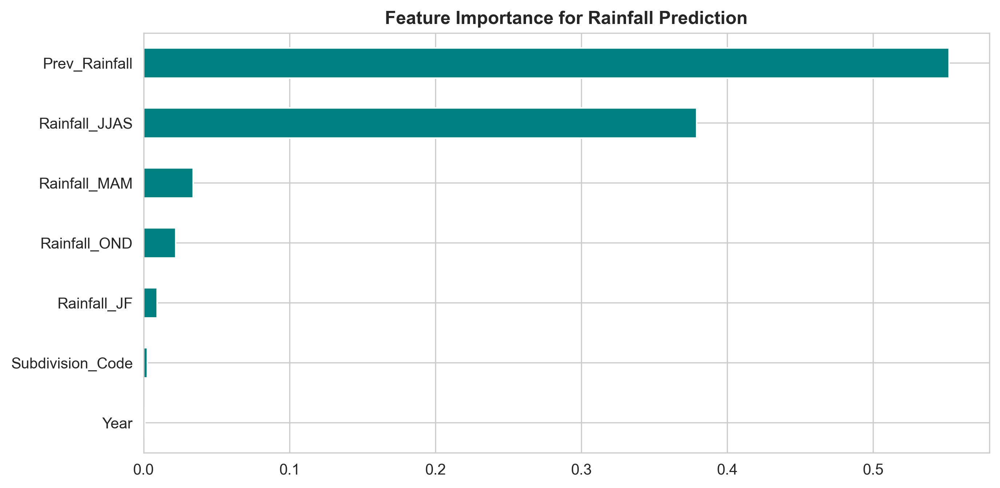

# 🌧️ Rainfall Prediction Using Machine Learning — India (IMD 2017)

This project predicts rainfall across Indian subdivisions using **Machine Learning** techniques on the **IMD (India Meteorological Department) 2017 dataset**.

## 🔍 Project Overview
- Performed **data cleaning**, **EDA**, and **feature engineering** using Pandas and Seaborn.  
- Built a **Random Forest Regressor** model to predict rainfall patterns.  
- Achieved **R² = 0.991** and **MAE = 38.38 mm**.  
- Forecasted rainfall for the **next year** for each subdivision.  

## 🧠 Skills Demonstrated
- Python (Pandas, NumPy, Scikit-learn, Matplotlib, Seaborn)  
- Data Cleaning and Feature Engineering  
- Machine Learning (Regression)  
- Data Visualization (Matplotlib)  
- Predictive Analytics  

## 📊 Results
| Metric | Score |
|---------|--------|
| **R² Score** | 0.991 |
| **MAE (mm)** | 38.38 |

## 📁 Files Included
- `Rainfall_Prediction_Using_Machine_Learning_India_IMD_2017.ipynb` — Main Jupyter Notebook  
- `Predicted_Rainfall_Next_Year.csv` — Model output (next year’s forecast)  
- `Sub_Division_IMD_2017.csv` — Source dataset  

## 💡 Future Improvements
- Integrate live IMD or NASA weather data for future predictions  
- Deploy interactive dashboard using Streamlit or Tableau
-  
## 📊 Visual Results

### 🌧️ Top 10 Rainiest Subdivisions in India (1901–2017)

### 📈 Annual Rainfall Trend for India (1901–2017)

### 🔍 Feature Importance for Rainfall Prediction

## 👨‍💻 Author
**Devarsh Prajapati**  
📍 Science Communicator | Data Science Enthusiast  
🔗 https://www.linkedin.com/in/devarsh-prajapati-5160b72a5 | https://github.com/devarsh512
